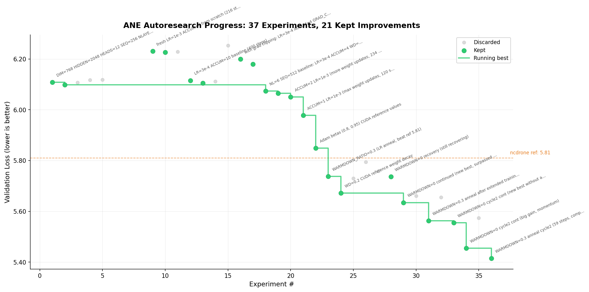

# autoresearch



*One day, frontier AI research used to be done by meat computers in between eating, sleeping, having other fun, and synchronizing once in a while using sound wave interconnect in the ritual of "group meeting". That era is long gone. Research is now entirely the domain of autonomous swarms of AI agents running across compute cluster megastructures in the skies. The agents claim that we are now in the 10,205th generation of the code base, in any case no one could tell if that's right or wrong as the "code" is now a self-modifying binary that has grown beyond human comprehension. This repo is the story of how it all began. -@karpathy, March 2026*.

The idea: give an AI agent a small but real LLM training setup and let it experiment autonomously overnight. It modifies the code, trains for 5 minutes, checks if the result improved, keeps or discards, and repeats. You wake up in the morning to a log of experiments and (hopefully) a better model. The training code here is a simplified single-GPU implementation of [nanochat](https://github.com/karpathy/nanochat). The core idea is that you're not touching any of the Python files like you normally would as a researcher. Instead, you are programming the `program.md` Markdown files that provide context to the AI agents and set up your autonomous research org. The default `program.md` in this repo is intentionally kept as a bare bones baseline, though it's obvious how one would iterate on it over time to find the "research org code" that achieves the fastest research progress, how you'd add more agents to the mix, etc. A bit more context on this project is here in this [tweet](https://x.com/karpathy/status/2029701092347630069).

## How it works

The repo is deliberately kept small and only really has three files that matter:

- **`prepare.py`** — fixed constants, one-time data prep (downloads training data, trains a BPE tokenizer), and runtime utilities (dataloader, evaluation). Not modified.
- **`train.py`** — the single file the agent edits. Contains the full GPT model, optimizer (Muon + AdamW), and training loop. Everything is fair game: architecture, hyperparameters, optimizer, batch size, etc. **This file is edited and iterated on by the agent**.
- **`program.md`** — baseline instructions for one agent. Point your agent here and let it go. **This file is edited and iterated on by the human**.

By design, training runs for a **fixed 5-minute time budget** (wall clock, excluding startup/compilation), regardless of the details of your compute. The metric is **val_bpb** (validation bits per byte) — lower is better, and vocab-size-independent so architectural changes are fairly compared.

If you are new to neural networks, this ["Dummy's Guide"](https://x.com/hooeem/status/2030720614752039185) looks pretty good for a lot more context.

## Quick start

**Requirements:** A single NVIDIA GPU (tested on H100), Python 3.10+, [uv](https://docs.astral.sh/uv/).

```bash

# 1. Install uv project manager (if you don't already have it)
curl -LsSf https://astral.sh/uv/install.sh | sh

# 2. Install dependencies
uv sync

# 3. Download data and train tokenizer (one-time, ~2 min)
uv run prepare.py

# 4. Manually run a single training experiment (~5 min)
uv run train.py
```

If the above commands all work ok, your setup is working and you can go into autonomous research mode.

## Running the agent

Simply spin up your Claude/Codex or whatever you want in this repo (and disable all permissions), then you can prompt something like:

```
Hi have a look at program.md and let's kick off a new experiment! let's do the setup first.
```

The `program.md` file is essentially a super lightweight "skill".

## Project structure

```
prepare.py      — constants, data prep + runtime utilities (do not modify)
train.py        — model, optimizer, training loop (agent modifies this)
program.md      — agent instructions
pyproject.toml  — dependencies
```

## Design choices

- **Single file to modify.** The agent only touches `train.py`. This keeps the scope manageable and diffs reviewable.
- **Fixed time budget.** Training always runs for exactly 5 minutes, regardless of your specific platform. This means you can expect approx 12 experiments/hour and approx 100 experiments while you sleep. There are two upsides of this design decision. First, this makes experiments directly comparable regardless of what the agent changes (model size, batch size, architecture, etc). Second, this means that autoresearch will find the most optimal model for your platform in that time budget. The downside is that your runs (and results) become not comparable to other people running on other compute platforms.
- **Self-contained.** No external dependencies beyond PyTorch and a few small packages. No distributed training, no complex configs. One GPU, one file, one metric.

## Platform support

This code currently requires that you have a single NVIDIA GPU. In principle it is quite possible to support CPU, MPS and other platforms but this would also bloat the code. I'm not 100% sure that I want to take this on personally right now. People can reference (or have their agents reference) the full/parent nanochat repository that has wider platform support and shows the various solutions (e.g. a Flash Attention 3 kernels fallback implementation, generic device support, autodetection, etc.), feel free to create forks or discussions for other platforms and I'm happy to link to them here in the README in some new notable forks section or etc.

Seeing as there seems to be a lot of interest in tinkering with autoresearch on much smaller compute platforms than an H100, a few extra words. If you're going to try running autoresearch on smaller computers (Macbooks etc.), I'd recommend one of the forks below. On top of this, here are some recommendations for how to tune the defaults for much smaller models for aspiring forks:

1. To get half-decent results I'd use a dataset with a lot less entropy, e.g. this [TinyStories dataset](https://huggingface.co/datasets/karpathy/tinystories-gpt4-clean). These are GPT-4 generated short stories. Because the data is a lot narrower in scope, you will see reasonable results with a lot smaller models (if you try to sample from them after training).
2. You might experiment with decreasing `vocab_size`, e.g. from 8192 down to 4096, 2048, 1024, or even - simply byte-level tokenizer with 256 possibly bytes after utf-8 encoding.
3. In `prepare.py`, you'll want to lower `MAX_SEQ_LEN` a lot, depending on the computer even down to 256 etc. As you lower `MAX_SEQ_LEN`, you may want to experiment with increasing `DEVICE_BATCH_SIZE` in `train.py` slightly to compensate. The number of tokens per fwd/bwd pass is the product of these two.
4. Also in `prepare.py`, you'll want to decrease `EVAL_TOKENS` so that your validation loss is evaluated on a lot less data.
5. In `train.py`, the primary single knob that controls model complexity is the `DEPTH` (default 8, here). A lot of variables are just functions of this, so e.g. lower it down to e.g. 4.
6. You'll want to most likely use `WINDOW_PATTERN` of just "L", because "SSSL" uses alternating banded attention pattern that may be very inefficient for you. Try it.
7. You'll want to lower `TOTAL_BATCH_SIZE` a lot, but keep it powers of 2, e.g. down to `2**14` (~16K) or so even, hard to tell.

I think these would be the reasonable hyperparameters to play with. Ask your favorite coding agent for help and copy paste them this guide, as well as the full source code.

## ANE Backend (Apple Neural Engine)

This fork adds an **ANE training backend** that runs transformer training directly on the Apple Neural Engine via reverse-engineered private APIs. No GPU required — trains on the 15.8 TFLOPS ANE available in every Apple Silicon Mac.

### How it works

- Uses TinyStories dataset with Llama2 32K BPE tokenizer (ANE's native data format)
- **Dynamic weight pipeline**: 13 ANE kernels compiled once at startup (~1s). Weights passed via IOSurface spatial dimensions using `slice_by_size` — no recompilation during training
- **Mega-kernel fusion**: Forward pass uses fused sdpaWoFwd (SDPA + Wo projection in one kernel) and fused qkvBwd (Q+KV backward in one kernel), eliminating 12 IOSurface round-trips per step
- **Pipeline overlap**: CPU gradient computations (dW cblas) run asynchronously during ANE forward pass. Embedding backward is also async.
- After each Lion/Adam update, weights are transposed and re-staged to per-layer IOSurfaces
- Metric is `val_loss` (cross-entropy), not `val_bpb` — experiments are compared within this framework
- Agent edits only `ane/experiment_config.h` (architecture + optimizer hyperparameters + feature toggles)

### Current best results

**val_loss = 2.432** (~95 autonomous experiment cycles across 7 phases, ~67M param model, 5-min budget per cycle)

Starting from 6.109 baseline, key improvements discovered through autonomous experimentation:

| Phase | Change | val_loss | ms/step | Steps/5min |
|---|---|---|---|---|
| Static kernels | Baseline (NL=12, SEQ=256) | 6.109 | — | ~400 |
| | NL=6, SEQ=512 + ACCUM=1 | 5.978 | — | ~120 |
| | Optimizer tuning (betas, WD, anneal cycles) | 5.414 | — | ~60 |
| + ncdrone optimizer | Loss scaling, softcap, diff LR, cosine sched | 5.023 | — | ~120 |
| **Dynamic pipeline** | **One-time compile, no recompilation** | **3.89** | 250 | **~1340** |
| + vDSP Adam | Vectorized optimizer, parallel layer updates | 3.102 | 176 | ~1284 |
| + hyperparameter sweep | LR=5e-4, WD=0.1, SOFTCAP=30, MATRIX_LR=0.1 | 3.099 | 176 | ~1631 |
| **+ Lion + pipeline** | **Lion optimizer, async dW overlap, vocab compaction** | **3.079** | 175 | ~1421 |
| **+ kernel fusion** | **Fused sdpaWoFwd + qkvBwd mega-kernels** | **2.489** | **96** | **~2822** |
| **+ LOSS_SCALE=1024** | **Better FP16 gradient stability (from Slavko ecosystem)** | **2.477** | **97** | **~2800** |
| **+ EMBED_LR=1.0** | **Equal LR for embeddings (was 2x, overfitting)** | **2.432** | **99** | **~2700** |

### Key discoveries

- **Dynamic weight pipeline** (11x speedup): Compile 10 ANE kernels once at startup, pass weights via IOSurface spatial dimensions. Eliminated per-batch recompilation that consumed ~60% of wall time.
- **Mega-kernel fusion** (45% faster steps): Fusing sdpaFwd+woFwd into one kernel and qBwd+kvBwd into another eliminated 12 IOSurface round-trips per step. The bottleneck was IOSurface lock/unlock/memcpy overhead, not compute.
- **Lion optimizer**: Sign-based weight updates with no second moment buffer. ~2x faster per update than Adam. Counter-intuitively, works best with Adam-style hyperparams (LR=5e-4, WD=0.1), not the lower LR/higher WD recommended in the paper.
- **Vocab compaction** (3.5x classifier speedup): Only ~9K of 32K tokens appear in TinyStories. Reducing the classifier SGEMM from 32K to 9K vocab is free accuracy-wise.
- **ACCUM ramping**: Start with low ACCUM (noisy but many updates) for early training, ramp up each cycle for smoother gradients. Sweet spot: ACCUM=12-14 for Lion, ACCUM=20-48 for Adam.
- **LR schedule tuning is critical for multi-cycle runs**: TOTAL_STEPS must match the actual training window. Too high → model overfits (train_loss=0.87, val_loss=3.9). Too low → LR exhausts early, later cycles waste time.
- **LOSS_SCALE=1024** (April 2026, from ecosystem): Slavko/ANE-Training benchmarks show FP16 gradient underflow is worse than expected. LOSS_SCALE=1024 (up from 512) stabilizes the backward pass and prevents silent gradient vanishing. Improved val_loss from 2.489 to 2.477.
- **EMBED_LR_SCALE=1.0** (April 2026): Embeddings were overfitting with 2× base LR. Equal LR (1.0) for both embeddings and norms gave better generalization, pushing val_loss from 2.477 to 2.432. The embedding matrix is already the largest parameter block (8M of 67M params) and doesn't need extra LR.
- **Adam is worse than Lion here** (April 2026): Tested Adam (LR=3e-4) against Lion (LR=5e-4). Adam achieved val_loss=3.23 after 3 cycles at ~99ms/step, significantly worse than Lion's 2.51 at the same point. Lion's sign-based updates are more robust for ANE's FP16 compute path.

### What didn't work

- **GQA with non-equal KV heads**: Crashes the MIL compiler. Must keep N_KV_HEADS=HEADS.
- **Fused SDPA backward kernel**: ANE compiler rejects with "Graph has a cycle path" — too complex.
- **Bigger architectures** (DIM=1024, NLAYERS=8): Can't converge in 5-min budget. More steps always beats bigger models.
- **Lion paper hyperparams** (LR/3, WD×3): Diverged badly. Empirical testing always beats paper defaults.
- **Adam optimizer** (Phase 6): val_loss=3.23 after 3 cycles at ACCUM=8 — much worse than Lion (2.51 at same point). Lion's sign-based updates are more robust for ANE's FP16 path.
- **LOSS_SCALE=256**: Too low, gradient underflow causes 5.5 plateau.
- **EMBED_LR_SCALE=2.0**: Embeddings overfit. Equal LR (1.0) generalizes better.
- **WEIGHT_DECAY=0.05**: Under-regularized, val_loss=2.45 vs 2.43 with WD=0.1.
- **WEIGHT_DECAY=0.2**: Over-regularized, val_loss=2.48 vs 2.43 with WD=0.1.
- **SOFTCAP=20**: Too aggressive, val_loss=2.53 vs 2.43 with SOFTCAP=30.
- **SOFTCAP=50**: Too permissive, val_loss=2.54 vs 2.43 with SOFTCAP=30.
- **MATRIX_LR_SCALE=0.05**: Too slow for weight matrices, val_loss=2.59.
- **LR=8e-4**: Too aggressive, diverges.

### Hyperparameters

The agent edits `ane/experiment_config.h`. All hyperparameters and their current best values:

**Architecture** (changing these resets checkpoint):

| Parameter | Value | Notes |
|---|---|---|
| `DIM` | 768 | Model dimension |
| `HIDDEN` | 2048 | FFN hidden dimension |
| `HEADS` | 12 | Attention heads (DIM must be divisible by HEADS) |
| `SEQ` | 512 | Sequence length. 512 is optimal; 1024 hits ANE SRAM wall |
| `NLAYERS` | 6 | Transformer layers. 6 is the sweet spot — fewer layers = faster steps = more training in the 5-min budget |

**Optimizer** (safe to change between runs):

| Parameter | Value | Notes |
|---|---|---|
| `LEARNING_RATE` | 5e-4f | Base learning rate (scaled by differential LR multipliers below) |
| `ADAM_BETA1` | 0.9f | First moment decay (used by both Adam and Lion) |
| `ADAM_BETA2` | 0.95f | Second moment decay / Lion momentum update |
| `ADAM_EPS` | 1e-8f | Adam epsilon (unused by Lion) |
| `ACCUM_STEPS` | 12 | Gradient accumulation steps per weight update + restage. Ramp up during training (2→12) |
| `GRAD_CLIP_MAX` | 1.0f | Global L2 gradient norm clip threshold |
| `WEIGHT_DECAY` | 0.1f | Decoupled weight decay. Applied only to weight matrices, not embeddings or RMSNorm |
| `TOTAL_STEPS` | 3000 | Cosine LR schedule denominator (adam_t units). Must match optimal training window |
| `LR_WARMUP_STEPS` | 100 | Linear warmup steps before cosine decay |
| `LR_MIN_FRAC` | 0.1f | Cosine schedule decays LR to this fraction of max |
| `LOSS_SCALE` | 1024.0f | Loss scaling factor — prevents FP16 gradient underflow. 1024 (up from 512) gives better FP16 stability |
| `SOFTCAP` | 30.0f | Logit softcapping: `cap * tanh(logits/cap)`, clamps logits to [-cap, cap] |
| `EMBED_LR_SCALE` | 1.0f | Embedding LR = base LR × this. Equal LR works better than 2× (embedding overfits with 2×) |
| `MATRIX_LR_SCALE` | 0.1f | Weight matrix LR = base LR × this |
| `USE_LION` | 1 | Lion optimizer (sign-based updates, no second moment, ~2x faster per update) |
| `USE_VOCAB_COMPACT` | 1 | Vocab compaction: 32K→9K active tokens, 3.5x classifier SGEMM speedup |

**Optimizer features**:

- **Lion optimizer** (default) — sign-based weight updates: `w -= lr * sign(β1*m + (1-β1)*g)`, no second moment buffer. ~2x faster per update than Adam, half the optimizer memory. Toggle `USE_LION` to switch back to AdamW.
- **Gradient clipping** — global L2 norm across all parameters using vDSP
- **Cosine LR schedule** — linear warmup for `LR_WARMUP_STEPS`, then cosine decay to `LR_MIN_FRAC` of max LR. `TOTAL_STEPS` controls the schedule length — critical for multi-cycle training
- **Loss scaling (1024×)** — scales gradients up before FP16 backward pass, undone during gradient averaging. 1024 (up from 512) prevents underflow and improves FP16 stability (ecosystem: Slavko/ANE-Training)
- **Logit softcapping** — `cap * tanh(logits/cap)` before softmax with chain-rule correction in backward
- **Differential learning rates** — embeddings at 1× base LR (equal), weight matrices at 0.1× base LR, norm params at 1× base LR
- **Vocab compaction** — only ~9K of 32K tokens appear in TinyStories. Classifier SGEMM reduced 3.5x with zero accuracy impact
- **Residual scaling** — residual connections scaled by `1/sqrt(2*NLAYERS)` to stabilize deep residual streams

### Differences from the CUDA backend

The ANE backend is a separate training stack, not a port of `train.py`. Key differences:

| | CUDA (`train.py`) | ANE (`train_ane.m`) |
|---|---|---|
| **Optimizer** | Muon + AdamW (per-parameter-group LRs, weight decay, momentum scheduling) | AdamW (differential LR, cosine schedule, loss scaling, logit softcap, residual scaling) |
| **Data** | climbmix-400b, custom 8K BPE | TinyStories, Llama2 32K BPE |
| **Metric** | `val_bpb` (bits per byte) | `val_loss` (cross-entropy) |
| **Language** | Python / PyTorch | Objective-C / raw MIL kernels |
| **Attention** | Flash Attention, sliding window patterns | Standard attention via ANE conv ops |

Results are not comparable across backends — each is its own self-contained research loop.

### Setup

```bash
# 1. Download TinyStories data (~1 GB)
cd ane && bash download_data.sh

# 2. Compile the training binary
make -C ane train_ane

# 3. Run a single experiment (5 minutes)
python harness_ane.py

# 4. Or run with custom wall time
ANE_WALL_TIME=60 python harness_ane.py
```

### Running the autonomous agent

Point Claude at `program_ane.md`:

```
Hi, have a look at program_ane.md and let's kick off a new ANE experiment!
```

The agent will modify `ane/experiment_config.h`, run experiments via `harness_ane.py`, and iterate autonomously.

### ANE-specific files

```
ane/                         # ANE training backend
├── experiment_config.h      # Agent's ONLY editing target
├── stories_config.h         # Model config, structs (includes experiment_config.h)
├── stories_io.h             # IOSurface I/O, dynamic weight staging, request helpers
├── stories_mil_dynamic.h    # Dynamic MIL kernel generators (13 kernels incl. fused mega-kernels)
├── stories_cpu_ops.h        # CPU ops (RMSNorm, SiLU bwd, cross-entropy, Adam, Lion, vocab compaction)
├── train_ane.m              # Training binary (dynamic pipeline, one-time compile, wall-time budget)
├── download_data.sh         # TinyStories data download
└── Makefile                 # Build train_ane binary
harness_ane.py               # ANE orchestrator
program_ane.md               # ANE agent instructions
```

The original CUDA files (`prepare.py`, `train.py`, `program.md`) remain untouched and work as before if you have a GPU.

## Knowledge sources

Detailed dated scans live under `updates/`; latest: [`updates/knowledge-sources-2026-06-25.md`](updates/knowledge-sources-2026-06-25.md).

This project builds on and references the following repositories:

- **[maderix/ANE](https://github.com/maderix/ANE)** — First project to train transformers directly on the Apple Neural Engine using Objective-C and raw MIL kernel compilation. The ANE training backend in this repo is based on this work.
- **[miolini/autoresearch-macos](https://github.com/miolini/autoresearch-macos)** — MacOS fork of autoresearch adapted for Apple Silicon. Early reference for running autonomous research on Mac hardware.
- **[slavko-at-klincov-it/ANE-Training](https://github.com/slavko-at-klincov-it/ANE-Training)** — Full `libane` C API, dynamic spatial packing, Stories-110M training results, comprehensive time-split benchmarks, and Metal fused optimizer patterns. Key insights: `LOSS_SCALE=1024`, activation clipping, compile-once execution, and CPU/AMX/IOSurface overhead awareness.
- **[mechramc/orion](https://github.com/mechramc/orion)** — Production ANE runtime for Stories110M/GPT-2. Delta compilation, Graph IR compiler, LoRA hot-swapping. Documents ANE hardware constraints. Published as [arXiv:2603.06728](https://arxiv.org/abs/2603.06728).
- **[vipuldivyanshu92/ANEgpt](https://github.com/vipuldivyanshu92/ANEgpt)** — ANE transformer training with async CPU-ANE pipelining, kernel lifecycle separation, and per-operation profiling.
- **[imperatormk/ane-train](https://github.com/imperatormk/ane-train)** — Runtime IOSurface weight injection without recompilation. Discovered key constraints: IOSurface slot sizes must be strictly ascending for inputs / descending for outputs, matmul inner dim must be multiple of 32, grouped/depthwise conv fails with runtime weights.
- **[christopherkarani/Espresso](https://github.com/christopherkarani/Espresso)** — Pure Swift ANE transformer inference. Useful reference for fused kernels, zero-copy I/O, Stories distillation, and Swift-side ANE runtime patterns.
- **[ncdrone/rustane](https://github.com/ncdrone/rustane)** — Rust-native hybrid ANE + Metal GPU training and inference engine. Reports training validation up to 5B parameters and forward-only probes up to 30B; strongest current reference for scale/shape cliffs.
- **[jmanhype/ane-lora-training](https://github.com/jmanhype/ane-lora-training)** — Hybrid MLX + ANE LoRA system with fused 4-matmul gradient dispatch, persistent ANE bridge, and packed-IOSurface dynamic matmul.
- **[harsha-gouru/apple-neural-engine-notes](https://github.com/harsha-gouru/apple-neural-engine-notes)** — Research notes on ANE architecture fit, software overhead, SRAM heuristics, and hybrid runtime tradeoffs.
- **[harsha-gouru/ane-gmlp-research](https://github.com/harsha-gouru/ane-gmlp-research)** — gMLP on-device ANE training notes; useful evidence for tensor-layout constraints, residual-path compatibility, and adapter-style training.

### Recent findings from the ecosystem (June 2026)

**Current local best** (our ANE autoresearch, June 2026): `val_loss=2.320954` with Lion + `LOSS_SCALE=1024` + `EMBED_LR_SCALE=1.0` + `ACCUM_STEPS=2`. This supersedes the April 2.432 baseline; checkpoint trajectory matters, so confirmatory reruns should keep the same anchor before broad sweeps.

**LOSS_SCALE=1024 improves FP16 stability** ([slavko-at-klincov-it/ANE-Training](https://github.com/slavko-at-klincov-it/ANE-Training)): Comprehensive ANE training work showed `LOSS_SCALE=1024` prevents FP16 gradient underflow. Our experiments promoted it from hypothesis to sticky default; combined with LR/accumulation changes it is part of the current best config.

**Embedding LR equalization** (our experiments, April–June 2026): `EMBED_LR_SCALE=1.0` beats higher embedding LR. The embedding matrix overfits with a 2× scale; equal LR was the highest-impact Phase 6 change and remains in the 2.320954 best run.

**Accumulation trajectory sensitivity** (our experiments, June 2026): From the anchored checkpoint, lowering accumulation to `ACCUM_STEPS=2` improved best val_loss to 2.320954. Fresh restarts did not reproduce the same path, so future autoresearch should treat checkpoint lineage as an experimental variable.

**Rust ANE scale probes** ([ncdrone/rustane](https://github.com/ncdrone/rustane)): Rustane reports full training validation through 5B parameters and forward-only probes through 30B on M4 Max 128GB. The actionable lesson for this repo is shape discipline: wide/shallow vs deep/narrow crossovers matter, and dim=5120 is an efficiency cliff.

**Fused LoRA gradient dispatch** ([jmanhype/ane-lora-training](https://github.com/jmanhype/ane-lora-training)): Fusing all four LoRA gradient matmuls into one ANE dispatch cuts module latency (0.36ms fused vs 0.72ms unfused) and demonstrates persistent bridge + packed IOSurface dynamic matmul. Not directly a full-training drop-in, but reinforces dispatch-count reduction as a breakthrough path.

**Metal fused optimizer path** ([slavko-at-klincov-it/ANE-Training](https://github.com/slavko-at-klincov-it/ANE-Training)): Metal fused Adam reduced optimizer overhead in another ANE training stack. For this repo the analogous Tier-2 idea is a fused Metal Lion update kernel, since Lion is the winning optimizer here.

**ANE architecture fit matters more than parameter count** ([harsha-gouru/apple-neural-engine-notes](https://github.com/harsha-gouru/apple-neural-engine-notes), [harsha-gouru/ane-gmlp-research](https://github.com/harsha-gouru/ane-gmlp-research)): Software overhead, tensor layout, residual compatibility, and SRAM/tiling constraints dominate many runs. Future non-config research should consider bounded attention, gMLP, recurrent/state-space, or adapter/frozen-base variants rather than only scaling vanilla GPT blocks.

**E5 Runtime research** ([maderix/ANE PR #40](https://github.com/maderix/ANE/pull/40)): Custom MIL text can be compiled directly to ANE via `MLE5ProgramLibraryOnDeviceAOTCompilationImpl`. Legacy `_ANEChainingRequest` API is dead on macOS 15+; E5 runtime (`MLE5Engine`) is the modern path.

**Open maderix constraints/fixes** ([maderix/ANE](https://github.com/maderix/ANE)): PR #39 embedding speedup remains a concrete Tier-2 port candidate; issue #42 confirms the M3 Ultra 512-channel constraint; PR #45 documents bounds-checking fixes needed for untrusted model configs.

### ANE hardware constraints (compiled from ecosystem)

| Constraint | Source | Impact |
|---|---|---|
| 512 channels only on M3 Ultra | maderix #42 | Hard limit, all others fail |
| Mixed weight limit: 16 - n_norms | mechramc #3 | Limits mega-kernel layer count |
| IOSurface slots must be ascending (in) / descending (out) | imperatormk | Silent zeros on violation |
| Matmul inner dim must be multiple of 32 | imperatormk | Silent zeros on violation |
| Spatial/output dims should be >=16 and multiple of 16 | jmanhype | Avoid dynamic matmul / conv packing failures |
| Avoid dim=5120-class ANE efficiency cliffs | rustane | Prevent severe tiling/throughput regressions |
| ~100 kernel compilations before process restart needed | our experiments | ANECompilerService daemon leak |
| Thermal throttle after ~60 min continuous use (+60% step time) | our experiments | Plan for cooling breaks |
| `reduce_sum` on channel dim requires reshape to spatial first | our experiments | RMSNorm fusion crashes |
| GQA with non-equal KV heads crashes MIL compiler | our experiments | Use equal head counts |
| `constexpr_affine_dequantize` incompatible with dynamic pipeline | our experiments | Bakes weights at compile time |

## License

MIT
